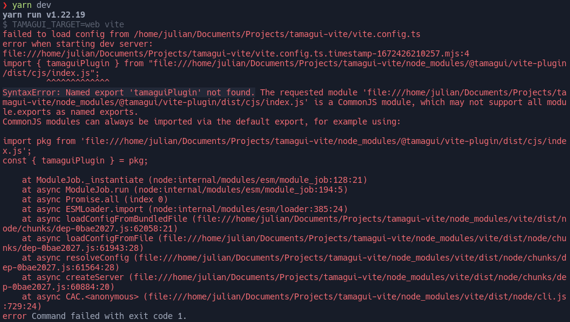

# Vite Tamagui

This repo shows a minimal reproduction example to get tamagui and vite running.

## How to get it running?

1. Clone the repo.
2. Go to repo directory.
3. Execute `yarn` to install dependencies.
4. Execute `yarn dev` to run the project.

## Main issue

I get the following error message: `SyntaxError: Named export 'tamaguiPlugin' not found.`
This comes from the vite plugin.

## How to recreate this example by yourself

1. Create a vite project with `yarn create vite project-name`.
2. [Follow the installation guide.](https://tamagui.dev/docs/intro/installation)
3. [And follow the vite guide.](https://tamagui.dev/docs/guides/vite)
